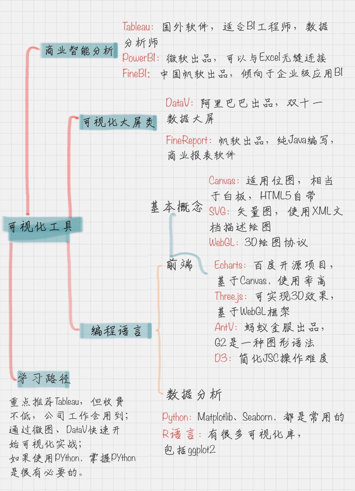
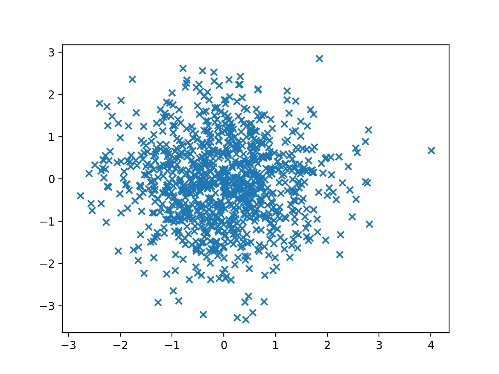
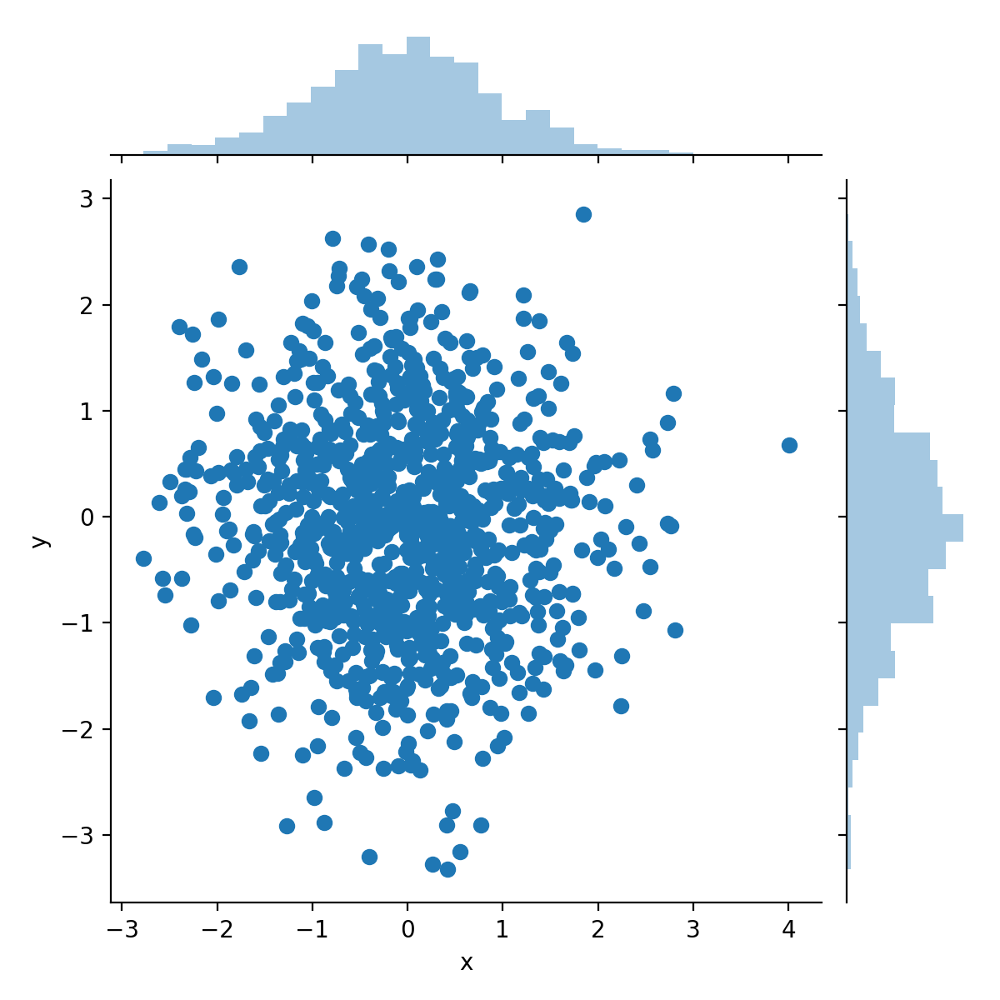

[TOC]

#**数据采集：如何自动化采集**

数据的走势，由多个维度影响，需要多源的数据采集，收集尽可能多的数据维度，保证数据质量，得到高质量的数据挖掘结果。多数时候自动切换IP以及云采集是自动化采集的关键。

##**数据源从采集角度方面划分为四类**：

​	开放数据源：政府、企业、高校

​	爬虫抓取：网页、App

​	日志采集：前端采集、后端脚本

​	传感器：图像、测速、热敏

##**如何使用开放数据源**

使用开放数据源可以从多个维度考虑：

1.单位维度：政府、高校

2.行业维度：交通、金融、能源

​	单位维度的数据源：

​	|欧盟|提供欧盟各机构的大量数据|http://open-data.europa.eu/en/data/|

​        |Facebook|查询该网站用户公开的海量信息|https://developers.facebook,com/docs/graph-api	|	

​	|Amazo|亚马逊网络服务开放数据集|http://aws.amazon.com/datasets|

​	|Google|谷歌金融，40年以来的股票数据，实时更新|http://www.google.com/finance|

​	|北京大学|北京大学开放研究数据平台|http://opendata.pku.edn.cn|

​	|ImageNet|图像识别量最大的数据库，包括近1500万张图像|http://www.image-net.org|

##**如何使用爬虫抓取**

1.Python爬虫  Requests、XPath、Pandas是Python的三个利器。其它还有Selenium、PhantommJs

2.第三方抓取贡酒：

​	火车采集器：抓取、数据清洗、数据分析、数据挖掘、可视化，适用于大多数网页

​	八爪鱼：免费采集模块是内容采集规则，包括电商、生活服务类、社交媒体类和论坛类

​                       云采集是配置好采集任务，通过云端多节点并发采集，还可以自动切换多个IP

​	集搜客：完全可视化，无需编程。无云采集功能，

##**如何使用日志采集工具**

日志采集最大的作用，就是通过分析用户访问情况，提升系统的性能，从而提高系统承载量。及时发现系统承载瓶颈，可以方便技术人员基于用户实际的访问情况进行优化。

日志采集形式：

1.通过Web服务器采集，例如httpd、Nginx、Tomcat等自带日志记录功能。同时很多互联网企业有自己的海量数据采集工具，多用于系统日志采集，如Hadoop的Chukwa、Clouder的Flume、Facebook的Scribe

2.自定义采集用户行为，例如用JavaScript代码监听用户的行为，AJAX异步请求后台记录日志等

##**埋点**

埋点就是在有需要的位置采集相应的信息，进行上报。包括用户信息、设备信息；用户停留时长等

在需要统计数据的地方植入统计代码，植入代码可以自己写，也可以使用第三方统计工具。需要自己写的diam，都是主营核心业务，对于埋点监测性工具，许多成熟的第三方工具，比如友盟、Google Analysis、Talkingdata等。


--------------------------------------------

#**数据采集：用八爪鱼采集微博上的"D&G"评论**

采集流程步骤：

输入网页->输入关键词->点击搜索

流程设计：设置翻页 提取数据

启动采集： 启动本地采集

在设置流程的时候一定要先翻页再提取元素。遇到问题要用好流程视图和XPath

# **Python爬虫：自动化下载海报**

爬虫流程：打开网页、提取数据和保存数据

打开网页：使用Requests访问页面，得到服务器返回的HTML页面以及JSON数据

提取数据：针对HTML页面，使用XPath定位，提取数据；针对JSON数据，使用JSON进行解析

保存数据：使用Pandas保存数据，最后导出CSV文件

## **Requests 访问请求页面**

Requests 是Python HTTP的客户端库，编写爬虫的时候都会用到。Requests有两种方式访问：Get和Post。

用Get请求代码访问如下:

```python
>>> import requests as req
>>> r = req.get('http://www.douban.com')
```

用Post请求代码如下：

```python
r= req.post('http://xxx.com',data={'key':'value'})
```


## **XPath定位**

XPath是XML的路径语言，实际上是通过元素和属性进行导航，来定位位置。

​	node:选取node节点的所有子节点

​	/：从根节点选取

​	//:选取所有的当前节点，不考虑他们的位置

​	.当前节点

​	..父节点

​	@属性选择

​	| 或，两个节点的合计

​	text()当前路径下的文本内容

for example：

xpath('node')选取node节点的所有子节点

xpath('/div') 从根节点上选取div节点

xpath('//div')选取所有的div节点

xpath('./div')选取当前节点下的div节点

xpath('//@id')选取所有的id属性

XPath提供了100个内建函数，来做匹配，功能非常强大。使用XPath定位，会用到Python的解析库lxml。

若要定位到HTML中的所有列表项目，可以采用如下代码

```python
>>> from lxml import etree
>>> html = 'http.www.douban.com'
>>> html = etree.HTML(html)
>>> result = html.xpath('//li')
```

## **JSON对象**

JSON是一种轻量级的交互方式，在Python中有JSON库可以用来转换

```python
json.dumps() #将Python对象转换成json对象
json.loads() #将JSON对象转换成Python对象
```

for example：

```python
>> import json
>>> jsonData = '{"a":1,"b":2,"c":3,"d":4,"e":5}'
>>> input = json.loads(jsonData)
>>> print (input)
{'a': 1, 'b': 2, 'c': 3, 'd': 4, 'e': 5}
```

## **如何使用JSON数据自动下载**

知道了Python爬虫的基本原理和实现，事件一下使用JSON数据自动下载

如果爬取的页面是动态页面，需要关注XHR数据。XHR用于后台与服务器交换数据。利用Chrome浏览器的开发者工具可以在插件中查看XHR数据。

在豆瓣搜索中对王祖贤进行搜索，发现XHR中一个请求如下：

https://www.douban.com/j/search_photo?q=王祖贤&limit=20&start=0///

```python
#下载图片函数
>>> picpath = '/Users/apple/Downloads/' + '王祖贤'
>>> def download(src, id):
	dir = picpath +'/' + str(id) + '.jpg'
	try:
		pic = req.get(src, timeout = 10)
		fp = open(dir, 'wb')
		fp.write(pic.content)
		fp.close()
	except req.exceptions.ConnectionError:
		print ('图片无法下载')
```

用JSON方式下载的函数代码

```python
>>> if not os.path.isdir(picpath):
	os.mkdir(picpath)
 >>> query = '王祖贤'
>>> for i in range(0, 22471, 20):
	url = 'https://www.douban.com/j/search_photo?q='+query+'&limit=20&start='+str(i)
	html = req.get(url).text
	response = json.loads(html,encoding='utf-8')
	for image in response['images']:
		download(image['src'],image['id'])
```

## **使用XPath方式自动下载**

利用JSON请求方式，会受到加载的限制，只有JS都加载完毕后才能获取完整的HTML。但XPath可以不受加载的限制，帮我们定位想要的元素。

利用XPath进行下载需要用XPath定位图片的网址，以及电影的名称。快速定位XPPath的方法是采用浏览器的XPath Helper插件，快捷键是Ctrl + Shift + X,按住Shift 用鼠标选中想要的定位元素，会显示选中元素的XPath。

但有时候网页未加载完会导致直接用Request获取HTML的时候，发现想要的XPath不存在。因此需要一个工具进行网页模拟，这个工具是Python中的Selenium库

```
>>> from selenium import webdriver
>>> driver = webdriver.Chrome('/Users/apple/Downloads/chromedriver')
>>> driver.get(request_url)
```

要使用Webdriver，需要去下载<http://npm.taobao.org/mirrors/chromedriver/2.33/> 找到对应的版本，下载完成后再调用添加一下路径就可以调用了。

下载宫崎骏电影海报

对应的XPath为

```python
图片XPath：//div[@class='item-root']/a[@class='cover-link']/img[@class='cover']/@src
名称XPath://div[@class='item-root']/div[@class='detail']/div[@class='title']/a[@class='title-text']
```

notes：XPath获得的图片url格式可能与json格式下不一致，在获得页面内容时，用driver驱动则需要etree.HTML(driver.page_source)否则获得的页面XPath为空

整个下载过程如下:

```python
>>> import json
>>> import requests as req
>>> from lxml import etree
>>> from selenium import webdriver
>>> import os
>>> request_url = 'https://movie.douban.com/subject_search?search_text=宫崎骏&cat=1002'
>>> src_xpath = '//div[@class='item-root']/a[@class='cover-link']/img[@class='cover']/@src'
SyntaxError: invalid syntax
>>> src_xpath = "//div[@class='item-root']/a[@class='cover-link']/img[@class='cover']/@src"
>>> title_xpath = "//div[@class='item-root']/div[@class='detail']/div[@class='title']/a[@class='title-text']"
>>> print (src_xpath)
//div[@class='item-root']/a[@class='cover-link']/img[@class='cover']/@src
>>> driver = webdriver.Chrome('/Users/apple/Downloads/chromedriver')
>>> driver.get(request_url)
>>> html = etree.HTML(driver.page_source)
>>> srcs = html.xpath(src_xpath)
>>> print (srcs)
['https://img3.doubanio.com/view/celebrity/s_ratio_celebrity/public/p616.webp', 'https://img3.doubanio.com/f/movie/03d3c900d2a79a15dc1295154d5293a2d5ebd792/pics/movie/tv_default_large.png', 'https://img3.doubanio.com/view/photo/s_ratio_poster/public/p1606727862.webp', 'https://img3.doubanio.com/view/photo/s_ratio_poster/public/p2540924496.webp', 'https://img3.doubanio.com/view/photo/s_ratio_poster/public/p2174346180.webp', 'https://img1.doubanio.com/view/photo/s_ratio_poster/public/p1446261379.webp', 'https://img3.doubanio.com/view/photo/s_ratio_poster/public/p1613191025.webp', 'https://img3.doubanio.com/view/photo/s_ratio_poster/public/p456676352.webp', 'https://img3.doubanio.com/view/photo/s_ratio_poster/public/p454118602.webp', 'https://img3.doubanio.com/view/photo/s_ratio_poster/public/p456692072.webp', 'https://img3.doubanio.com/view/photo/s_ratio_poster/public/p1917567652.webp', 'https://img1.doubanio.com/view/photo/s_ratio_poster/public/p1998028598.webp', 'https://img3.doubanio.com/view/photo/s_ratio_poster/public/p617533616.webp', 'https://img1.doubanio.com/view/photo/s_ratio_poster/public/p2398213627.webp', 'https://img1.doubanio.com/view/photo/s_ratio_poster/public/p1637195728.webp', 'https://img3.doubanio.com/view/photo/s_ratio_poster/public/p1335271624.webp']
>>> titles = html.xpath(src_xpath）
>>> picpath = '/Users/apple/Downloads/宫崎骏电影海报'
>>> if not os.path.isdir(picpath):
	os.mkdir(picpath)
>>> def download(src, id):
	dic = picpath + '/' + str(id) + '.webp'
	try:
		pic = req.get(src, timeout = 30)
		fp = open(dic, 'wb')
		fp.write(pic.content)
		fp.close()
	except req.exceptions.ConnectionError:
		print ('图片无法下载')
>>> for i in range(0, 150, 15):
	url = request_url + '&start=' + str(i)
	driver.get(url)
	html = etree.HTML(driver.page_source)
	srcs = html.xpath(src_xpath)
	titles = html.xpath(title_xpath)
	for src,title in zip(srcs, titles):
		download(src, title.text)
>>> 

```

#**数据清洗：数据分析工作中的重中之重**

好的数据分析师必定是一名数据清洗高手，要知道在整个数据分析过程中，无论在时间上还是功夫上，数据清洗大概占到了80%。

#**数据质量准则**

1.完整性：单条数据是否存在空值，统计的字段是否完善

2.全面性：一列或一行的数据是否有异常情况

3.合法性：数据的类型、内容、大小的合法性

4.唯一性：数据是否存在重复

数据要标准、干净、连续

##**数据清洗**

1.完整性问题：

缺失：整行缺失

空值：均值补全或最高频率补全

2.全面性问题：

单列数据不统一

3.合理性问题：

非ASCII字符问题

4.唯一性

一列有多个参数

重复数据

数据清洗练习：

```python
>> import pandas
>>> import pandas as pd
>>> from pandas import Series,DataFrame
#读取数据
>>> df = DataFrame(pd.read_excel('/Users/apple/Desktop/GitHubProject/Read mark/数据分析/geekTime/data/accountMessage.xlsx'))
>>> print (df)
    \t     0               1     2           3    4    5    6    7    8    9
0    0   1.0    Mickey Mouse  56.0       70kgs   72   69   71    -    -    -
1    1   2.0    Donald Dunck  34.0   154.89lbs    -    -    -   85   84   76
2    2   3.0      Mini Mouse  16.0         NaN    -    -    -   65   69   72
3    3   4.0  Scrooge McDuck   NaN       78kgs   78   79   72    -    -    -
4    4   5.0    Pink Panther  54.0  198.658lbs    -    -    -   69  NaN   75
5    5   6.0    Huey  McDuck  52.0      189lbs    -    -    -   68   75   72
6    6   7.0    Dewey McDuck  19.0       56kgs    -    -    -   71   78   75
7    7   8.0      Scoopy Doo  32.0       78kgs   78   76   75    -    -    -
8    8   NaN             NaN   NaN         NaN  NaN  NaN  NaN  NaN  NaN  NaN
9    9   9.0    Huey  McDuck  52.0      189lbs    -    -    -   68   75   72
10  10  10.0    Louie McDuck  12.0       45kgs    -    -    -   92   95   87
#删除出指定列
>>> df.drop(columns=[0,'\t'],inplace=True)

#替换列名称
>>> df.rename(columns={1:'name',2:'age',3:'weights',4:'m0006',5:'m0612',6:'m1218',7:'f0006',8:'f0612',9:'f1218'},inplace=True)

#对age列用平均值进行数据补全
>>> df['age'].fillna(df['age'].mean(),inplace=True)

#对weights列用出现次数最多的数据进行补全
>>> df['weights'].fillna(df['weights'].value_counts().index[0],inplace=True)

#删除全空行
>>> df.dropna(how='all',inplace=True)

#获取weights列以英镑为单位的数据
>>> lbs_row = df['weights'].str.contains('lbs').fillna(False)
>>> print (df[lbs_row])
           name        age     weights m0006 m0612 m1218 f0006 f0612 f1218
1  Donald Dunck  34.000000   154.89lbs     -     -     -    85    84    76
2    Mini Mouse  16.000000      189lbs     -     -     -    65    69    72
4  Pink Panther  54.000000  198.658lbs     -     -     -    69   NaN    75
5  Huey  McDuck  52.000000      189lbs     -     -     -    68    75    72
8           NaN  36.333333      189lbs   NaN   NaN   NaN   NaN   NaN   NaN
9  Huey  McDuck  52.000000      189lbs     -     -     -    68    75    72

#删除第八行数据
>>> df.drop(index=[8],inplace=True)
>>> print (df)
              name        age     weights m0006 m0612 m1218 f0006 f0612 f1218
0     Mickey Mouse  56.000000       70kgs    72    69    71     -     -     -
1     Donald Dunck  34.000000   154.89lbs     -     -     -    85    84    76
2       Mini Mouse  16.000000      189lbs     -     -     -    65    69    72
3   Scrooge McDuck  36.333333       78kgs    78    79    72     -     -     -
4     Pink Panther  54.000000  198.658lbs     -     -     -    69   NaN    75
5     Huey  McDuck  52.000000      189lbs     -     -     -    68    75    72
6     Dewey McDuck  19.000000       56kgs     -     -     -    71    78    75
7       Scoopy Doo  32.000000       78kgs    78    76    75     -     -     -
9     Huey  McDuck  52.000000      189lbs     -     -     -    68    75    72
10    Louie McDuck  12.000000       45kgs     -     -     -    92    95    87
>>> print (df[lbs_row])

Warning (from warnings module):
  File "__main__", line 1
UserWarning: Boolean Series key will be reindexed to match DataFrame index.
           name   age     weights m0006 m0612 m1218 f0006 f0612 f1218
1  Donald Dunck  34.0   154.89lbs     -     -     -    85    84    76
2    Mini Mouse  16.0      189lbs     -     -     -    65    69    72
4  Pink Panther  54.0  198.658lbs     -     -     -    69   NaN    75
5  Huey  McDuck  52.0      189lbs     -     -     -    68    75    72
9  Huey  McDuck  52.0      189lbs     -     -     -    68    75    72

#获取数据值，计算成kg数值并替换
>>> for i, row in df[lbs_row].iterrows():
	weight = int(float(row['weights'][:-3])/2.2)
	df.at[i,'weights'] = '{}kgs'.format(weight)

>>> print (df)
              name        age weights m0006 m0612 m1218 f0006 f0612 f1218
0     Mickey Mouse  56.000000   70kgs    72    69    71     -     -     -
1     Donald Dunck  34.000000   70kgs     -     -     -    85    84    76
2       Mini Mouse  16.000000   85kgs     -     -     -    65    69    72
3   Scrooge McDuck  36.333333   78kgs    78    79    72     -     -     -
4     Pink Panther  54.000000   90kgs     -     -     -    69   NaN    75
5     Huey  McDuck  52.000000   85kgs     -     -     -    68    75    72
6     Dewey McDuck  19.000000   56kgs     -     -     -    71    78    75
7       Scoopy Doo  32.000000   78kgs    78    76    75     -     -     -
9     Huey  McDuck  52.000000   85kgs     -     -     -    68    75    72
10    Louie McDuck  12.000000   45kgs     -     -     -    92    95    87

##删除非ASICC字符
>>> df.replace({r'[^\x00-\x7F]+':''},regex=True)
              name  age weights m0006 m0612 m1218 f0006 f0612 f1218
0     Mickey Mouse   56   70kgs    72    69    71     -     -     -
1     Donald Dunck   34   70kgs     -     -     -    85    84    76
2       Mini Mouse   16   85kgs     -     -     -    65    69    72
3   Scrooge McDuck   36   78kgs    78    79    72     -     -     -
4     Pink Panther   54   90kgs     -     -     -    69   NaN    75
5     Huey  McDuck   52   85kgs     -     -     -    68    75    72
6     Dewey McDuck   19   56kgs     -     -     -    71    78    75
7       Scoopy Doo   32   78kgs    78    76    75     -     -     -
9     Huey  McDuck   52   85kgs     -     -     -    68    75    72
10    Louie McDuck   12   45kgs     -     -     -    92    95    87
>>> df['f0612'].fillna(df['f0612'].mean())
Traceback (most recent call last):
  File "/Library/Frameworks/Python.framework/Versions/3.6/lib/python3.6/site-packages/pandas/core/nanops.py", line 127, in f
    result = alt(values, axis=axis, skipna=skipna, **kwds)
  File "/Library/Frameworks/Python.framework/Versions/3.6/lib/python3.6/site-packages/pandas/core/nanops.py", line 479, in nanmean
    the_sum = _ensure_numeric(values.sum(axis, dtype=dtype_sum))
  File "/Library/Frameworks/Python.framework/Versions/3.6/lib/python3.6/site-packages/numpy/core/_methods.py", line 36, in _sum
    return umr_sum(a, axis, dtype, out, keepdims, initial)
TypeError: must be str, not int
  
 #将姓名一栏删除，分成fist_name,last_name两列
>>> df[['first_name','last_name']] = df['name'].str.split(expand=True)
>>> df.drop('name',axis=1,inplace=True)

#删除重复数据
>>> df.drop_duplicates()
    age weights m0006 m0612 m1218 f0006 f0612 f1218 first_name last_name
0    56   70kgs    72    69    71     -     -     -     Mickey     Mouse
1    34   70kgs     -     -     -    85    84    76     Donald     Dunck
2    16   85kgs     -     -     -    65    69    72       Mini     Mouse
3    36   78kgs    78    79    72     -     -     -    Scrooge    McDuck
4    54   90kgs     -     -     -    69   NaN    75       Pink   Panther
5    52   85kgs     -     -     -    68    75    72       Huey    McDuck
6    19   56kgs     -     -     -    71    78    75      Dewey    McDuck
7    32   78kgs    78    76    75     -     -     -     Scoopy       Doo
10   12   45kgs     -     -     -    92    95    87      Louie    McDuck
>>> df.drop_duplicates(inplace=True)

#交互列
>>> columns = list(df)
>>> columns.insert(0,columns.pop(columns.index('last_name')))
>>> columns
['last_name', 'age', 'weights', 'm0006', 'm0612', 'm1218', 'f0006', 'f0612', 'f1218', 'first_name']
>>> columns.insert(0,columns.pop(columns.index('first_name')))
>>> df = df.ix[:,columns]
>>> print (df)
   first_name last_name  age weights m0006 m0612 m1218 f0006 f0612 f1218
0      Mickey     Mouse   56   70kgs    72    69    71     -     -     -
1      Donald     Dunck   34   70kgs     -     -     -    85    84    76
2        Mini     Mouse   16   85kgs     -     -     -    65    69    72
3     Scrooge    McDuck   36   78kgs    78    79    72     -     -     -
4        Pink   Panther   54   90kgs     -     -     -    69   NaN    75
5        Huey    McDuck   52   85kgs     -     -     -    68    75    72
6       Dewey    McDuck   19   56kgs     -     -     -    71    78    75
7      Scoopy       Doo   32   78kgs    78    76    75     -     -     -
10      Louie    McDuck   12   45kgs     -     -     -    92    95    87

#过滤有数值的列数据
>>> f0612_rows = df['f0612'].str.isalnum().fillna(True)
>>> print (f0612_rows)
0     False
1      True
2      True
3     False
4      True
5      True
6      True
7     False
10     True
Name: f0612, dtype: bool
>>> print (df[f0612_rows])
   first_name last_name  age weights m0006 m0612 m1218 f0006 f0612 f1218
1      Donald     Dunck   34   70kgs     -     -     -    85    84    76
2        Mini     Mouse   16   85kgs     -     -     -    65    69    72
4        Pink   Panther   54   90kgs     -     -     -    69   NaN    75
5        Huey    McDuck   52   85kgs     -     -     -    68    75    72
6       Dewey    McDuck   19   56kgs     -     -     -    71    78    75
10      Louie    McDuck   12   45kgs     -     -     -    92    95    87
>>> f0612_mean = df[f0612_rows]['f0612'].mean()
>>> print (f0612_mean)
80.2
#进行数值补全
>>> df['f0612'].fillna(f0612_mean,inplace=True)
>>> print (df)
   first_name last_name  age weights m0006 m0612 m1218 f0006 f0612 f1218
0      Mickey     Mouse   56   70kgs    72    69    71     -     -     -
1      Donald     Dunck   34   70kgs     -     -     -    85    84    76
2        Mini     Mouse   16   85kgs     -     -     -    65    69    72
3     Scrooge    McDuck   36   78kgs    78    79    72     -     -     -
4        Pink   Panther   54   90kgs     -     -     -    69  80.2    75
5        Huey    McDuck   52   85kgs     -     -     -    68    75    72
6       Dewey    McDuck   19   56kgs     -     -     -    71    78    75
7      Scoopy       Doo   32   78kgs    78    76    75     -     -     -
10      Louie    McDuck   12   45kgs     -     -     -    92    95    87
>>> df.replace('-','',inplace = True)
>>> print (df)
   first_name last_name  age weights m0006 m0612 m1218 f0006 f0612 f1218
0      Mickey     Mouse   56   70kgs    72    69    71                  
1      Donald     Dunck   34   70kgs                      85    84    76
2        Mini     Mouse   16   85kgs                      65    69    72
3     Scrooge    McDuck   36   78kgs    78    79    72                  
4        Pink   Panther   54   90kgs                      69  80.2    75
5        Huey    McDuck   52   85kgs                      68    75    72
6       Dewey    McDuck   19   56kgs                      71    78    75
7      Scoopy       Doo   32   78kgs    78    76    75                  
10      Louie    McDuck   12   45kgs                      92    95    87

>>> df.reindex([0,1,2,4],method = 'bfill')
  first_name last_name  age weights m0006 m0612 m1218 f0006 f0612 f1218
0     Mickey     Mouse   56   70kgs    72    69    71                  
1     Donald     Dunck   34   70kgs                      85    84    76
2       Mini     Mouse   16   85kgs                      65    69    72
4       Pink   Panther   54   90kgs                      69  80.2    75
>>> print (df)
   first_name last_name  age weights m0006 m0612 m1218 f0006 f0612 f1218
0      Mickey     Mouse   56   70kgs    72    69    71                  
1      Donald     Dunck   34   70kgs                      85    84    76
2        Mini     Mouse   16   85kgs                      65    69    72
3     Scrooge    McDuck   36   78kgs    78    79    72                  
4        Pink   Panther   54   90kgs                      69  80.2    75
5        Huey    McDuck   52   85kgs                      68    75    72
6       Dewey    McDuck   19   56kgs                      71    78    75
7      Scoopy       Doo   32   78kgs    78    76    75                  
10      Louie    McDuck   12   45kgs                      92    95    87

#求取数值数量，并自动生成索引
>>> df.reindex(range(df.shape[0]),method = 'bfill')
  first_name last_name  age weights m0006 m0612 m1218 f0006 f0612 f1218
0     Mickey     Mouse   56   70kgs    72    69    71                  
1     Donald     Dunck   34   70kgs                      85    84    76
2       Mini     Mouse   16   85kgs                      65    69    72
3    Scrooge    McDuck   36   78kgs    78    79    72                  
4       Pink   Panther   54   90kgs                      69  80.2    75
5       Huey    McDuck   52   85kgs                      68    75    72
6      Dewey    McDuck   19   56kgs                      71    78    75
7     Scoopy       Doo   32   78kgs    78    76    75                  
8      Louie    McDuck   12   45kgs                      92    95    87
#将数据导出
>>> df.to_excel('/Users/apple/Desktop/GitHubProject/Read mark/数据分析/geekTime/data/accountMessage_new.xlsx')
```


## **养成数据审核的习惯**

没有高质量的数据，就没有高质量的数据挖掘，而数据清洗是高质量数据的一道保障。

越优秀的数据挖掘人员，越会有"数据审核"的"职业病"。

##课后练习

```python
>>> import pandas as pd
>>> from pandas import Serices,DataFrame
>>> df = DataFrame(pd.read_excel('Users/apple/Desktop/GitHubProject/Read mark/数据分析/geekTime/data/foodInformation.xlsx'))

#删除空值
>>>df.dropna(inplace=True)

#食物名称变为小写
>>>df['food'] = df['food'].str.lower

#查找重复数据，分组进行求和
>>>food_rows = df[df['food'].duplicated(keep=False)]
>>>food_items = food_rows.groupby('food').sum()
>>>food_items['food']=food_items.index
#循环遍历，进行求和
>>> for i,row in food_items.iterrows():
    df.loc[df['food']==row['food'],'ounces'] = row['ounces']

 #删除重复数据
>>>df.drop_duplicates(inplace=True)
#重新整理索引
>>>df.index=range(df.shape[0])
>>> print (df)
          food  ounces  animal
0        bacon    12.0     pig
1  pulled port     3.0     pig
2     pastrami     3.0     cow
3  corned beef     7.5     cow
4    honey ham     5.0     pig
5     nova lox     6.0  salmon
```


# **数据集成**

数据挖掘前我们需要的数据往往分布在不同的数据源中，需要考虑字段表达是否一样，以及属性是否冗余，所以数据集成也占有重要的一步。数据集成具有更广泛的意义，包括了数据清洗、数据抽取、数据集成和数据变化等操作。

## **数据集成的两种架构：ELT和ETL**

数据工程师的工作包括了数据的ETL和数据挖掘算法的实现。

ETL: Extract 、Transform 和 Load的缩写，包括了数据抽取、转换、加载三个过程

抽取是将数据从数据源中提取出来。转换是对数据进行处理，例如表1和表2进行连接形成一张新的表。


如果是三张表则可以先操作表1、表2，形成新的表后再和表3连接

根据转换发生的顺序和位置，数据集可以分成ETL和ELT两种架构。

ETL的过程为提取(Extract)-转换(Transform)-加载(Load)在数据源抽取后首先进行转换，然后将转换的结果写入目的地。

ELT的过程则是提取(EXtract)-加载(Load)-变化(Transform),在抽取后将结果先写入目的地，然后利用数据库的聚合分析或者外部计算框架，如Spark来完成转换的步骤。

目前主流架构是ETL，但未来使用ELT作为数据集架构的越来越多。使用ELT的带来的好处是：

.ELT和ETL相比，最大的区别是"重抽取和加载，清转换"，从而可以用更轻量的方案搭建起一个数据集成平台。ELT方法，在提取完成之后，数据加载会立即开始。另一方面ELT允许BI分析人员无限制的访问整个原始结构，使得分析更灵活，能更好地支持业务。

.ELT架构，数据变换过程根据后续使用情况，需要在SQL中进行，而不是在加载阶段进行，这样可以从数据源中提取数据，经过少量预处理后进行加载。

##**ETL工具**

商业软件：Informatica PowerCenter、IBM InfoSphere DataStage、Oracle Data Integrator、Microsoft SQL Server Integration Services等

开源软件：Kettle、Talend、Apatar、Scriptella、DataX、Sqoop等


**Kettle工具**

Kettle采用可视化操作，对数据库间的数据进行迁移，包括两种可视化Transformation转换和Job作业。

创建Transformation转换：

创建步骤->中间转换->输出，两个主要概念Step和Hop。

Step(步骤)：转换的最小单元，每一个Step完成一个特定的功能。

Hop(跳跃线)：用来在转换中连接Step。它代表了数据的流向。


创建Job作业：

完整的任务是将创建好的转换和作业串联起来。Job包括两个概念：Job Entry、Hop。

Job Entry(工作实体): 是Job内部的执行单元，每一个工作实体都是用来执行具体的任务，比如调用转换，发送邮件等。

Hop：指连接Job Entry的线，可以指定是否有条件执行。

在Kettle中，可以使用Spoon，一种图形化的方式。

**阿里开源软件**：DataX

DataX可以实现跨平台、跨数据库、不同系统之间的数据同步及交互，它将自己作为标准连接不同的数据源，以完成他们之间的转换。

**Apache开源软件**:Sqoop

Sqoop 是一款开源的工具,是由 Apache 基金会所开发的分布式系统基础架构.Sqoop 在 Hadoop生态系统中是占据一席之地的.主要用来在 Hadoop

和关系型数据库中传递数据。通过 Sqoop，我们可以方便地将数据从关系型数据库导入到 HDFS 中，或者将数据从HDFS 导出到关系型数据库中。Hadoop 实现了一个分布式文件系统，即 HDFS。Hadoop 的框架最核心

的设计就是 HDFS 和 MapReduce。HDFS 为海量的数据提供了存储，而 MapReduce 则为海量的数据提供了计算。


#**数据变换**

数据变换可以让不同渠道的数据统一到一个目标数据库里。

## **数据变换在数据分析中的角色**

数据变换前，需要先对字段进行筛选，然后对数据进行探索和相关性分析，接着是选择算法模型，然后针对算法模型对数据需求进行数据变换，从而完成数据挖掘前准备工作。

​	`字段过滤` ——> `数据探索` ——>   `相关性分析` ——>  `建模筛选`    ——> `数据变换`

整个流程中，数据变换是数据准备的重要环节，它通过数据平滑、数据聚集、数据概化和规范化等方式将数据转换成适用于数据挖掘的形式。

##**数据变换常见方法**

1.**数据平滑**： 去除数据的噪声，将连续数据离散化。采用分箱、聚类和回归       的方法进行数据平滑。

2.**数据聚集**：对数据进行汇总，在SQL中有一些聚集函数可以操作，比如Max()反馈某个字段的数值最大值，Sum()返回某个字段的数值总和。

3.**数据概化**：将数据由较低的概念成为较高的概念，减少数据复杂度，即用更高的概念替代更低的概念。

4.**数据规范化**：使属性数据按比例缩放，这就将原来的数值映射到一个新的特定区域中。常用的方法有最小-最大规范化、Z-score规范化、按小数定标规范化等。

5.**属性构造**：构造出新的属性并添加到属性集中。这里会用到特征工程的知识，因为通过属性与属性 的连接构造新的属性，其实就是特征工程。举例来说，数据表中统计每个人的英语、语文和数学成绩，可以构造一个"总和"这个属性，来作为新属性。这样"总和"这个属性就可以用到后续的数据挖掘计算中。

##**数据规范化方法**

**1.Min-max规范化**

Min-max规范化方法是将原始数据变换到[0，1]的空间中。用公式表示就是：新数值=(原数值-极小值)/(极大值-极小值)

**2.Z-Score规范化**

Z-Score用来解决相同标准问题。新数值=(原数值-均值)/标准差

**3.小数定标规范化**

小数定标规范化是通过移动小数点的位置来进行规范化。小数点移动多少位取决于属性A的取值中的最大绝对值。

举例来说，属性A的取值范围是-999到88，那么最大绝对值为999，小数点就会移动3位，即新数值=原数值/1000.那么A的取值范围就被规划为-0.999到0.088。

##**利用Python的SciKit-Learn库进行规范化**

SciKit-Learn是Python的重要机器学习库，它封装了大量机器学习算法，比如分类、聚类、回归、降维等，还包括了数据变换模块。

使用SciKit-Learn进行数据规范化

1.利用sklearn进行Min-max规范化

在sklearn中有个函数MinMaxScaler专门让原始数据投射到指定空间[min，max]，允许给定最大值与最小值，默认情况下[min，max]是[0，1]，也就是把原始数据投放到[0，1]范围内。

```python
>>> from sklearn  import preprocessing
>>> import numpy as np
>>> #初始化数据
>>> x = np.array([[0.,-3,1],[3,1,2],[0,1,-1]])
>>> #将数据进行[0,1]规范化
>>> min_max_scaler = preprocessing.MinMaxScaler()
>>> print (min_max_scaler)
MinMaxScaler(copy=True, feature_range=(0, 1))
>>> minmax_x = min_max_scaler.fit_transform(x)
>>> print (minmax_x)
[[0.         0.         0.66666667]
 [1.         1.         1.        ]
 [0.         1.         0.        ]]
```

2.利用sklearn进行Z-Score规范化

在sklearn库中使用preprocessing.scale()函数，可以直接将给定数进行Z-Score规范化。

```python
>>> x=np.array([[0.,-3.,1.],[3.,1.,2.],[0.,1.,-1.]])
>>> scaled_x=preprocessing.scale(x)
>>> print (scaled_x)
[[-0.70710678 -1.41421356  0.26726124]
 [ 1.41421356  0.70710678  1.06904497]
 [-0.70710678  0.70710678 -1.33630621]]
```

Z-Score规范化将数据集进行了规范化，数值都符合均值为0，方差为1的正态分布。

3.利用NumPy库进行小数定标规范化

我们需要用Numpy库来计算小数点的位数

```python
>>> #小数定标规范化
>>> j = np.ceil(np.log10(np.max(abs(x))))
>>> print (j)
1.0
>>> scaled_x = x/(10**j)
>>> print (scaled_x)
[[ 0.  -0.3  0.1]
 [ 0.3  0.1  0.2]
 [ 0.   0.1 -0.1]]
```

ceil函数是Python中趋向于正无穷取整函数，利用对数取整得到要挪动的小说点位数。

##**数据变换重要性体现**

数据变换可以减少维度，减少计算成本，分散数据便于找到数据之间的特征。

## 课后练习

假设属性 income 的最小值和最大值分别是 5000 元和 58000 元。利用 Min-Max规范化的方法将属性的值映射到 0 至 1 的范围内，那么属性 income 的 16000 元将被转化为多少？

```python
>>> import numpy as np
>>> from sklearn import preprocessing
>>> x = np.array([[5000.],[16000.],[58000.]])
>>> min_max_x= preprocessing.MinMaxScaler().fit_transform(x)
>>> print (min_max_x)
[[0.        ]
 [0.20754717]
 [1.        ]]
```


#**数据可视化**

作为一名数据分析师，掌握可视化技能是必不可少的，结果的呈现很重要。

##**数据可视化视图**

常用的可视化视图有：文本表、热力图、地图、符号地图、饼图、水平条、堆叠条、并排条、树状图、圆视图、并排圆、线、双线、面积图、双组合、散点图、直方图、盒续图、甘特图、靶心图、气泡图等。

数据可视化大致有9种情况：


数据可视化之前要思考用户是谁，想给他们呈现什么，需要突出数据怎样的特点，以及采用哪种视图来进行呈现。具体要采用哪种视图，取决于想要数据可视化呈现什么样的目的。

##**数据可视化工具**

在商业智能分析软件中，最著名的属Tableau和PowerBI。

可视化大屏类DataV和FineReport

前端可视化组件基于Web渲染技术，Canvas、SVG和WebGL

编程语言Python语言和R语言。Python中包含了众多可视化库，最需要掌握的就是Matplotlib、Seaborn。



## 如何开始数据可视化学习

想要全面学习数据可视化，有以下途径

1.重点Tableau

2.使用微图、DataV

3.Python可视化 数据挖掘工程师或算法工程师，要数量掌握这项技能


#**Python可视化10种视图实践**

按照数据之间的关系，我们可以把可视化视图划分为 4 类，它们分别是比较、联系、构成和分布。这四种关系的特点：

1.比较：比较数据间各类别的关系，或者它们随着时间的变化趋势，比如折线图

2.联系：查看两个或两个以上变量之间的关系，比如散点图

3.构成：每个部分占整体的百分比，或者是随着时间的百分比变化，比如饼图。

4.分布：关注单个变量，或者多个变量的分布情况，比如直方图。

按照变量的个数，可以把可视化视图划分为单变量分析和多变量分析。

常用的10种视图是：散点图、折线图、直方图、条形图、箱线图、饼图、热力图、蜘蛛图、二元变量分布和成对关系。


散点图绘制：

散点图(scatter plot)适合展示两个变量之间的关系，既有二维散点图，还有三维散点图。接下来使用 Matplotlib和Seaborn进行散点图绘制

```python
>>> import numpy as np
>>> import pandas as pd
>>> import matplotlib.pyplot as plt
>>> import seaborn as sns
>>> #数据准备
>>> N = 1000
>>> x = np.random.randn(N)
>>> y = np.random.randn(N)
>>> #用Matplotlib画散点图
>>> plt.scatter(x,y,marker='x')
<matplotlib.collections.PathCollection object at 0x1234560f0>
>>> plt.show()
>>> #用Seaborn画散点图
>>> df = pd.DataFrame({'x':x,'y':y})
>>> sns.jointplot(x='x',y='y',data=df,kind='scatter')
<seaborn.axisgrid.JointGrid object at 0x12659df98>
>>> plt.show()

```

Matplotlib需要使用plt.scatter(x,y,marker=None)函数，x、y为坐标，marker代表了标记的符号。

Seaborn直接使用jointplot(x,y,data=None,kind='scatter')函数。其中x、y是data中的下标，data是要传入的数据，一般是DataFrame类型。



seaborn绘制：



Matplotlib默认呈现呈现长方形，而Seaborn呈现的是正方形并且还给了两个变量的分布情况。

